# TiledECDet — Architecture Reference

Complete visual documentation of the TiledECDet architecture, covering every
modified component and the data flow from raw image to detection output.

---

## 1. High-Level Pipeline Overview

The full inference/training pipeline from input image to bounding box predictions.
Components marked with **[MOD]** were modified; **[NEW]** are entirely new.

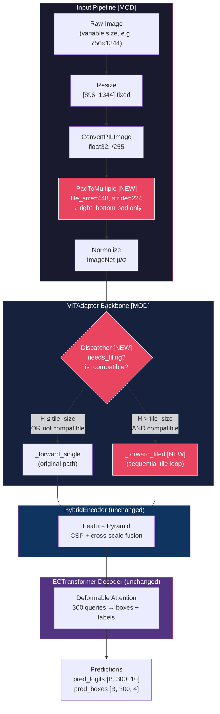

---

## 2. ECDet Model Composition

How the top-level `ECDet` wires backbone, encoder, and decoder together.
`tile_size` and `tile_stride` are injected from config into the backbone at init.

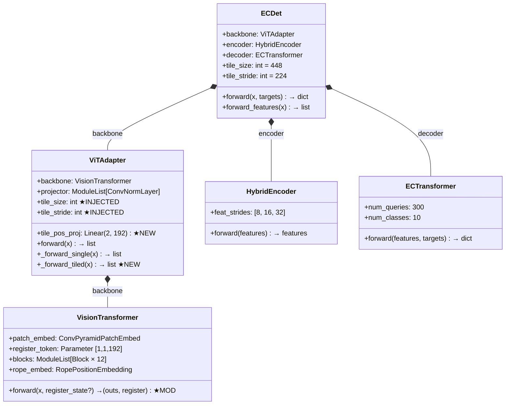

---

## 3. The Dispatcher — Routing Logic

The dispatcher in `ViTAdapter.forward` decides which path to take based on
the input dimensions and tile configuration.

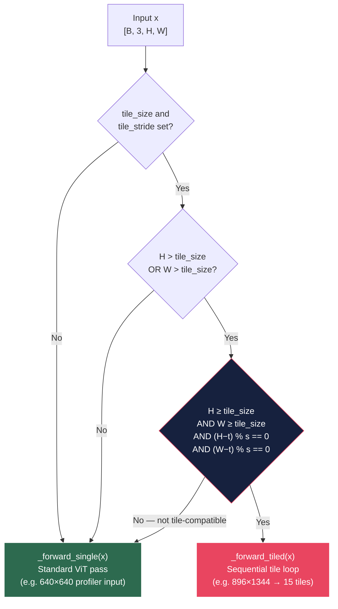

This prevents the 640×640 profiler input from crashing — 640 is larger than
`tile_size=448` but is not tile-compatible `(640−448) % 224 ≠ 0`.

---

## 4. _forward_single — Original Path (Unchanged Logic)

The standard inference path for small inputs. Numerically identical to the
original `ViTAdapter.forward` from the pretrained model.

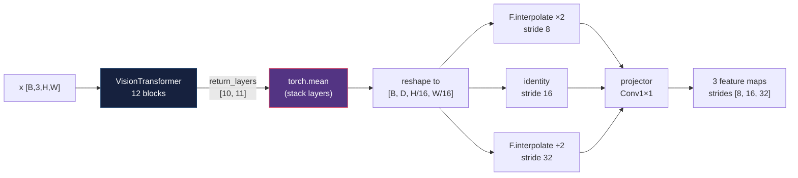

---

## 5. _forward_tiled — The Core Modification

This is the main new code path. It processes a high-resolution frame through
overlapping tiles sequentially, accumulating global context via the register token.

### 5a. Tile Extraction

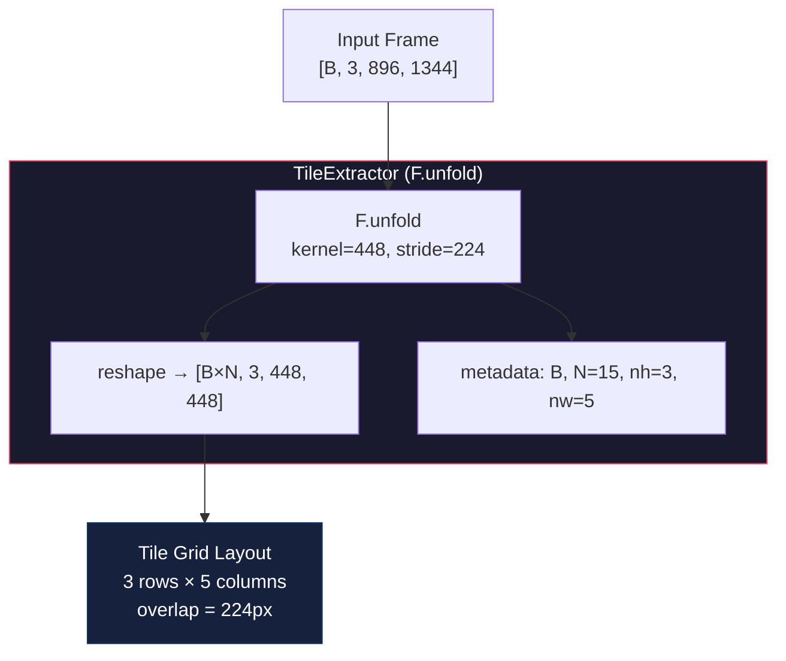

```
Input 896×1344 → 15 overlapping tiles (3×5)

 ┌────────┬───┬────────┬───┬────────┬───┬────────┬───┬────────┐
 │ tile 0 │   │ tile 1 │   │ tile 2 │   │ tile 3 │   │ tile 4 │  row 0
 │ 448×448│   │        │   │        │   │        │   │        │
 ├────────┤   ├────────┤   ├────────┤   ├────────┤   ├────────┤
 │overlap │224│        │224│        │224│        │224│        │
 ├────────┤   ├────────┤   ├────────┤   ├────────┤   ├────────┤
 │ tile 5 │   │ tile 6 │   │ tile 7 │   │ tile 8 │   │ tile 9 │  row 1
 │        │   │        │   │        │   │        │   │        │
 ├────────┤   ├────────┤   ├────────┤   ├────────┤   ├────────┤
 │ tile 10│   │ tile 11│   │ tile 12│   │ tile 13│   │ tile 14│  row 2
 │        │   │        │   │        │   │        │   │        │
 └────────┘   └────────┘   └────────┘   └────────┘   └────────┘
```

### 5b. Sequential Tile Processing with Register Accumulation

This is the heart of TiledECDet — the tile loop with register state passing.

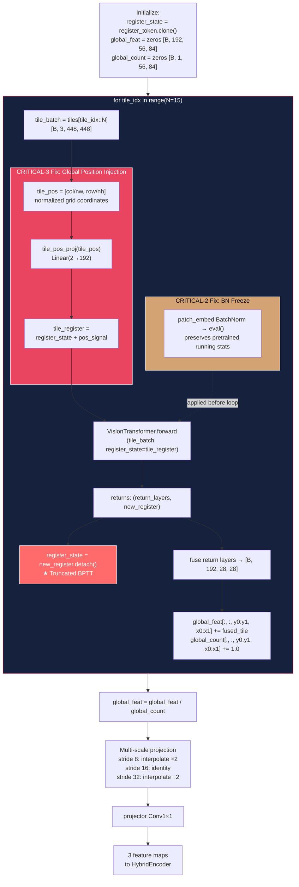

### 5c. Register State Flow Across Tiles

The register token accumulates global context as it passes through tiles in
raster-scan order (left-to-right, top-to-bottom).

```mermaid
flowchart LR
    R0["register_token<br/>(learned param)"]

    subgraph T0["Tile 0 (0,0)"]
        POS0["+ pos_proj(0.0, 0.0)"]
        VIT0["ViT 12 blocks"]
        OUT0["register_0"]
    end

    subgraph T1["Tile 1 (0,1)"]
        POS1["+ pos_proj(0.2, 0.0)"]
        VIT1["ViT 12 blocks"]
        OUT1["register_1"]
    end

    DOTS1["..."]

    subgraph T14["Tile 14 (2,4)"]
        POS14["+ pos_proj(0.8, 0.67)"]
        VIT14["ViT 12 blocks"]
        OUT14["register_14"]
    end

    R0 -->|clone| POS0 --> VIT0 --> OUT0
    OUT0 -->|".detach()"| POS1 --> VIT1 --> OUT1
    OUT1 -->|".detach()"| DOTS1
    DOTS1 -->|".detach()"| POS14 --> VIT14 --> OUT14

    style R0 fill:#533483,stroke:#fff,color:#fff
    style OUT0 fill:#2d6a4f,stroke:#fff,color:#fff
    style OUT1 fill:#2d6a4f,stroke:#fff,color:#fff
    style OUT14 fill:#2d6a4f,stroke:#fff,color:#fff
```

Key design decisions:
- **`.detach()`** between tiles: Truncated BPTT prevents gradient explosion
  through 15 sequential ViT passes (each 12 blocks deep).
- **`tile_pos_proj`**: Without this, RoPE normalizes every tile's coordinates
  to `[-1, +1]` independently — tile (0,0) and tile (2,4) look identical.
  The position projection adds 576 new parameters to break this ambiguity.

---

## 6. Feature Reassembly — Overlap Averaging

After the tile loop, overlapping tile features are averaged on the global
feature map using a count tensor.

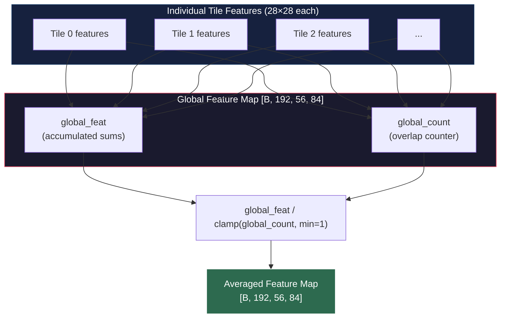

```
Overlap count map for 896×1344 input (feature space 56×84):

 count=1 ┊ count=2 ┊ count=2 ┊ count=2 ┊ count=1
 ┈┈┈┈┈┈┈┈┊─────────┊─────────┊─────────┊┈┈┈┈┈┈┈┈
 count=2 ┊ count=4 ┊ count=4 ┊ count=4 ┊ count=2
 ┈┈┈┈┈┈┈┈┊─────────┊─────────┊─────────┊┈┈┈┈┈┈┈┈
 count=1 ┊ count=2 ┊ count=2 ┊ count=2 ┊ count=1

 Corners: 1×  |  Edges: 2×  |  Interior: 4×
```

---

## 7. VisionTransformer.forward — Modified Signature

The only change to VisionTransformer itself: an optional `register_state` input
and a second return value.

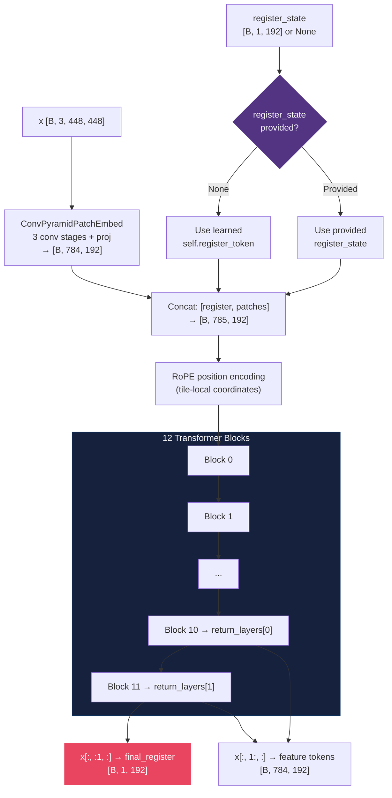

---

## 8. PadToMultiple Transform

Ensures every input image is tile-compatible before entering the model.
Applied after `ConvertPILImage` (operates on tensors, not PIL images).

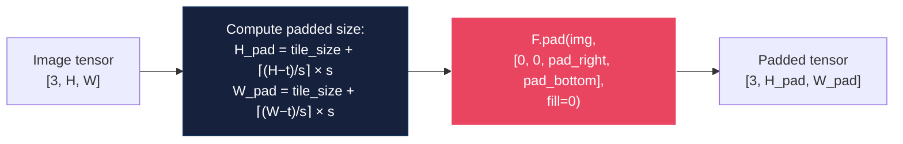

```
Example: 756×1344 with tile_size=448, stride=224

  Original (756×1344)           Padded (896×1344)
  ┌──────────────────┐          ┌──────────────────┐
  │                  │          │                  │
  │   image content  │  ────►   │   image content  │
  │                  │          │                  │
  └──────────────────┘          │ ─ ─ ─ ─ ─ ─ ─ ─ │
                                │  padding (zeros)  │  +140px bottom
                                └──────────────────┘

  Check: (896 − 448) % 224 = 448 % 224 = 0  ✓
         (1344 − 448) % 224 = 896 % 224 = 0  ✓
         Tiles: 3 rows × 5 cols = 15 tiles   ✓
```

---

## 9. Transform Pipeline — Train vs Val

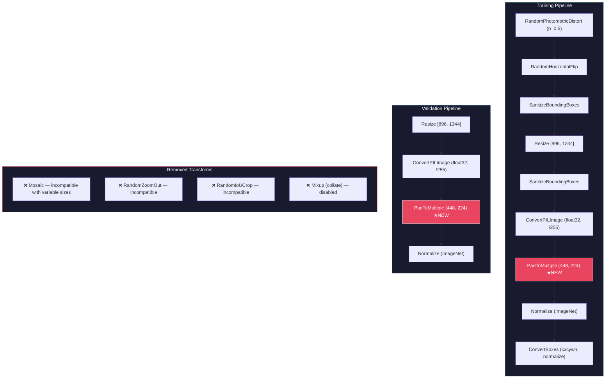

---

## 10. Dataset Pipeline — VisDrone MOT to COCO

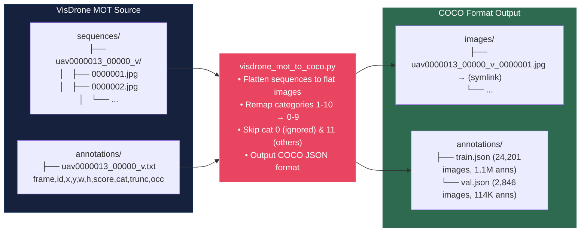

**Category mapping** (0-indexed to match `num_classes=10`):

| ID | Name | ID | Name |
|:--:|------|:--:|------|
| 0 | pedestrian | 5 | truck |
| 1 | people | 6 | tricycle |
| 2 | bicycle | 7 | awning-tricycle |
| 3 | car | 8 | bus |
| 4 | van | 9 | motor |

---

## 11. Optimizer Parameter Groups

Five groups with different learning rates — backbone frozen in Phase 1.

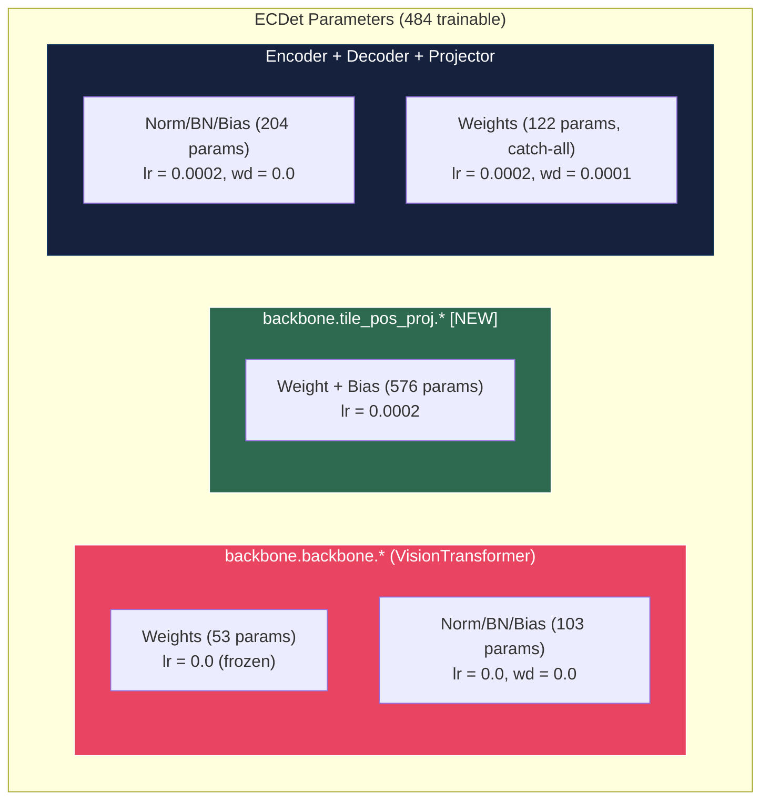

---

## 12. Critical Fixes Summary

Three critical issues were identified and fixed during implementation.

```mermaid
flowchart TD
    subgraph C1["CRITICAL-1: Variable Image Sizes"]
        C1P["Problem: torch.cat in collate<br/>crashes on different sizes"]
        C1F["Fix: Resize to fixed size<br/>+ PadToMultiple transform"]
    end

    subgraph C2["CRITICAL-2: BatchNorm Corruption"]
        C2P["Problem: BN in PatchEmbed<br/>updates running stats per tile<br/>(B=2 per tile pass)"]
        C2F["Fix: Force BN → eval()<br/>during tile loop,<br/>restore in finally block"]
    end

    subgraph C3["CRITICAL-3: Tile-Blind RoPE"]
        C3P["Problem: RoPE normalizes coords<br/>per tile → all tiles look identical<br/>at position (0,0)"]
        C3F["Fix: tile_pos_proj Linear(2→192)<br/>injects (col/nw, row/nh)<br/>into register state"]
    end

    subgraph C4["CRITICAL-4: reset_cfg Override"]
        C4P["Problem: reset_cfg() overrides<br/>Resize to square (640,640)<br/>+ cached pos_embed size mismatch"]
        C4F["Fix: Set eval_spatial_size: ~<br/>forces dynamic pos_embed<br/>and anchor generation"]
    end

    C1P --> C1F
    C2P --> C2F
    C3P --> C3F
    C4P --> C4F

    style C1 fill:#1a1a2e,stroke:#e94560,color:#fff
    style C2 fill:#1a1a2e,stroke:#d4a373,color:#fff
    style C3 fill:#1a1a2e,stroke:#533483,color:#fff
    style C4 fill:#1a1a2e,stroke:#2d6a4f,color:#fff
    style C1F fill:#2d6a4f,stroke:#fff,color:#fff
    style C2F fill:#2d6a4f,stroke:#fff,color:#fff
    style C3F fill:#2d6a4f,stroke:#fff,color:#fff
    style C4F fill:#2d6a4f,stroke:#fff,color:#fff
```

---

## 13. Modified Files Map

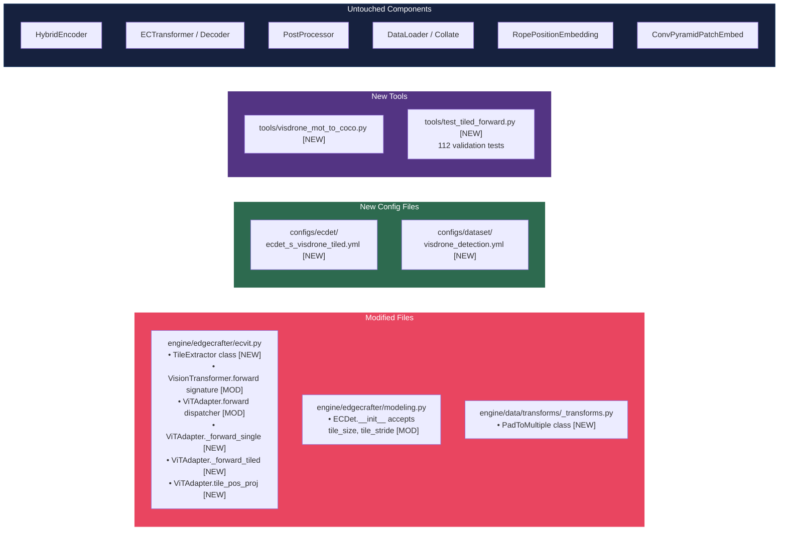

---

## 14. Size Reference Table

| Input | After Resize | After Pad | Tiles | Feature Map (s8) | Feature Map (s32) |
|-------|-------------|-----------|-------|-------------------|-------------------|
| 756×1344 | 896×1344 | 896×1344 | 3×5=15 | 112×168 | 28×42 |
| 1080×1920 | 896×1344 | 896×1344 | 3×5=15 | 112×168 | 28×42 |
| 640×640 | — | — | single pass | 80×80 | 20×20 |
| 448×448 | — | 448×448 | 1×1=1 | 56×56 | 14×14 |

**Model stats** (profiled at 640×640 single pass):
- Parameters: **9.77M** (576 new from `tile_pos_proj`)
- FLOPs: **25.8 GFLOPS** per single-tile pass
- Estimated FLOPs per 896×1344 frame: **~387 GFLOPS** (15 tiles × 25.8)
